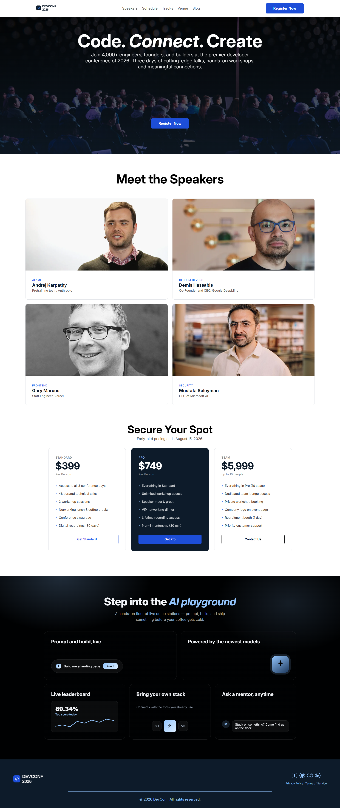

# DevConf 2026

A modern and responsive developer conference website designed for DevConf 2026.

## Live Demo

🔗 [https://sanzidakhatunbd.github.io/dev-conf-website/](https://sanzidakhatunbd.github.io/dev-conf-website/)

## Preview



## About The Project

DevConf 2026 is a modern conference landing page created as a frontend practice project. The website presents a developer conference with information about speakers, conference pricing, and an AI playground section.

The design focuses on a clean, modern, and responsive user experience.

## Technologies Used

- HTML5
- CSS3

## Features

- Responsive hero section
- Developer conference information
- Speaker profiles
- Conference pricing plans
- AI Playground section
- Call-to-action sections
- Responsive footer
- Clean and modern user interface
- Responsive design for different screen sizes

## Dependencies

No external frameworks or libraries were used.

This project was built using pure HTML5 and CSS3.

## How to Run Locally

1. Clone the repository:
```bash
git clone https://github.com/sanzidakhatunbd/dev-conf-website.git
```

2. Navigate into the project folder:
```bash
cd dev-conf-website
```

3. Open `index.html` in your browser:
   - Just double-click the `index.html` file, or
   - Use a tool like the **Live Server** extension in VS Code for the best experience.

## Repository

🔗 [https://github.com/sanzidakhatunbd/dev-conf-website](https://github.com/sanzidakhatunbd/dev-conf-website)
